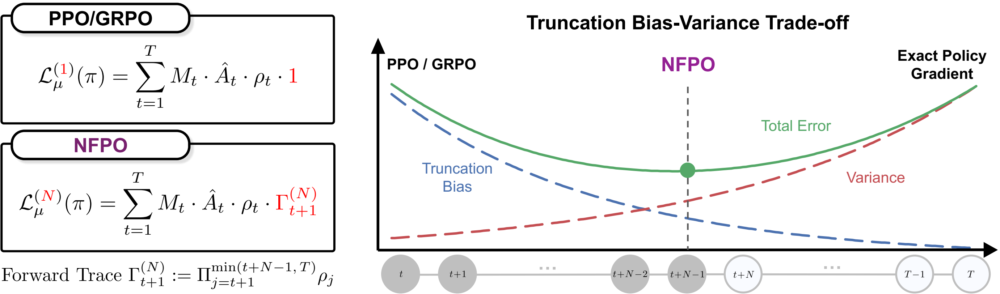

# NFPO

<p align="center">
  
</p>


This repository contains the NFPO implementation built on top of `verl`.
Please set up the environment following the official `verl` documentation:

- Documentation: https://verl.readthedocs.io/en/latest/
- Installation: https://verl.readthedocs.io/en/latest/start/install.html

## Quick Start

From the repository root, first prepare the training and evaluation data, then launch the example NFPO training run.

```bash
cd NFPO

# Prepare MATH training data and evaluation data.
bash examples/nfpo/prepare_nfpo_forward_trace_data.sh

# Run the example NFPO training script.
bash examples/nfpo/run_nfpo_forward_trace_math.sh
```

## NFPO Policy Loss Options

The example script enables the NFPO loss with:

```bash
actor_rollout_ref.actor.policy_loss.loss_mode=nfpo \
actor_rollout_ref.actor.policy_loss.mask_delta=0.2 \
actor_rollout_ref.actor.policy_loss.n_step_forward_trace=8 \
actor_rollout_ref.actor.policy_loss.forward_trace_ratio_clip=3 \
actor_rollout_ref.actor.policy_loss.forward_trace_lower=0.8 \
actor_rollout_ref.actor.policy_loss.forward_trace_upper=1.2 \
actor_rollout_ref.actor.policy_loss.forward_trace_use_rollout_old_log_probs=true
```

**Config map:**

- `loss_mode=nfpo`: selects the NFPO policy loss.
- `mask_delta`: threshold for the TV-based token mask.
- `n_step_forward_trace`: forward-trace horizon.
- `forward_trace_ratio_clip`: per-token ratio clipping threshold used when building the forward trace.
- `forward_trace_lower`, `forward_trace_upper`: lower and upper clipping bounds for the final forward-trace value.
- `forward_trace_use_rollout_old_log_probs=true`: uses rollout log probabilities as the old-policy anchor, avoiding an extra log-probability recomputation.

## Code Locations

- NFPO loss: `verl/trainer/ppo/core_algos.py`
- Training script: `examples/nfpo/run_nfpo_forward_trace_math.sh`
